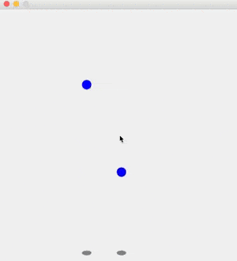

# BallSimulation
Project to practice multithreading techniques in Java. Creates a bouncing balls in a container.

## How to Use
Click inside the window to generate a ball in a random direction. Continue clicking to add more balls.

##Demonstration

